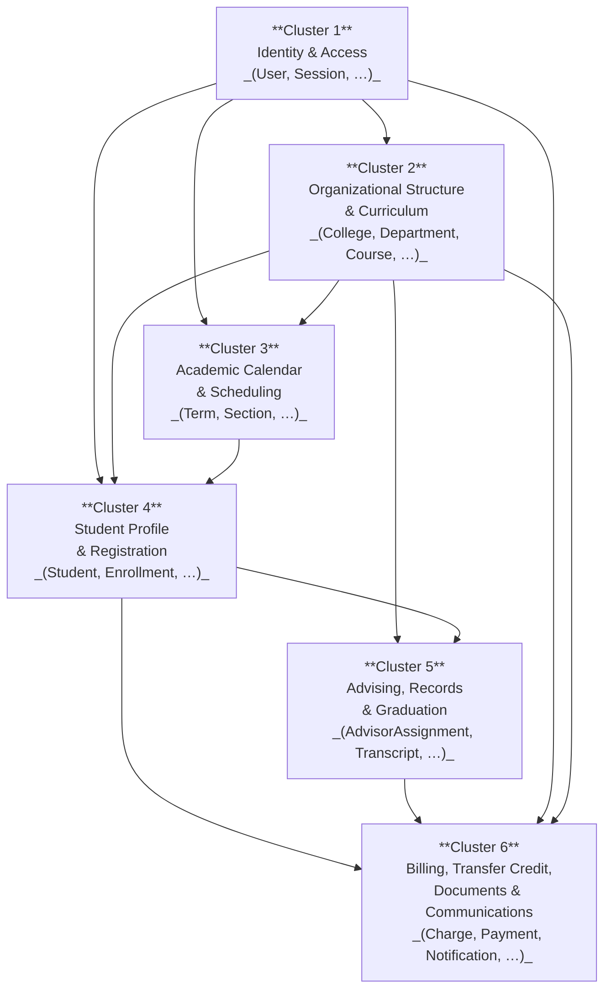
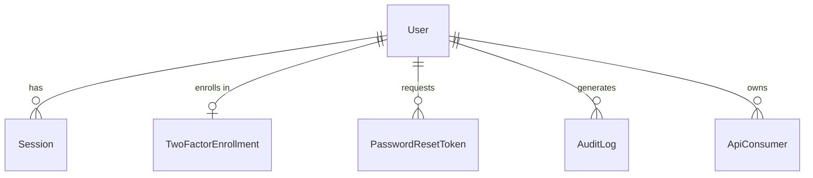
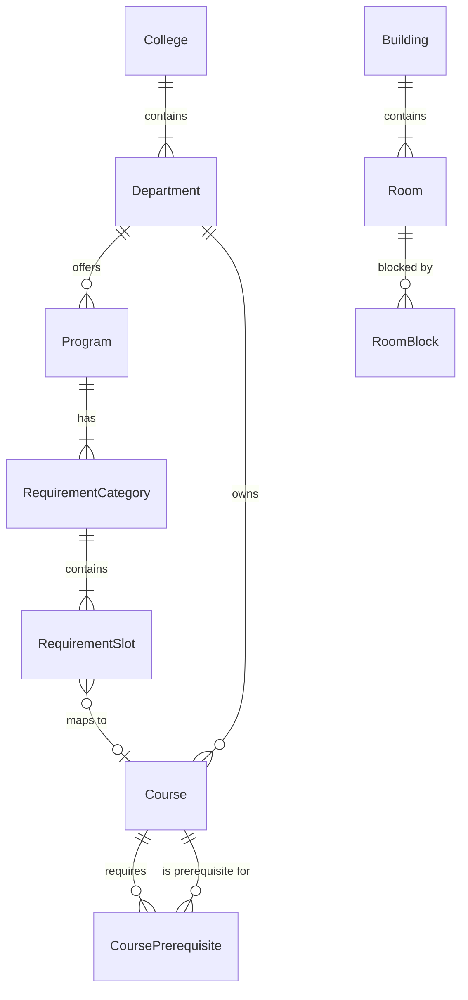
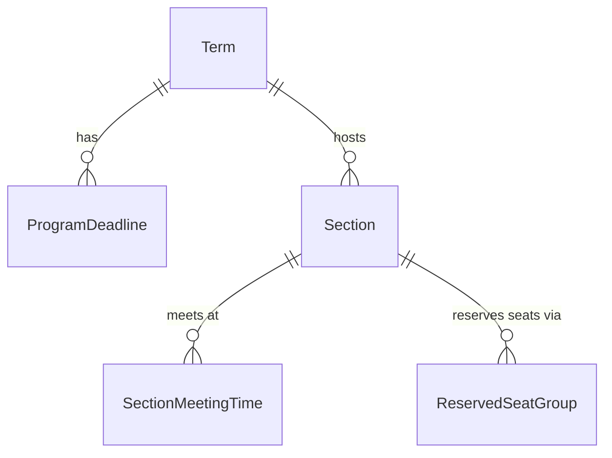
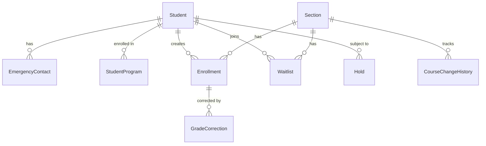
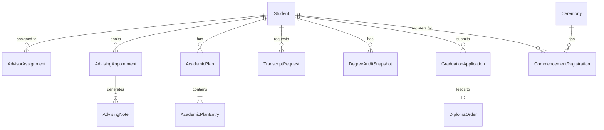
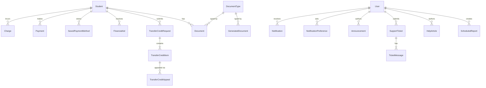

# Data Model

> **Status:** Living document — update whenever entities or attributes change.
> **Last updated:** 2026-02-18

This document defines the canonical entity model for the University Registration System (URS). It is the authoritative reference for database schema design, API contract design, and code generation.

---

## 1. Conventions

| Convention | Rule |
|---|---|
| **Primary keys** | All PKs are `uuid` (v4) unless noted |
| **Timestamps** | All timestamps are `timestamptz` stored in UTC |
| **Implied columns** | `created_at timestamptz NOT NULL DEFAULT now()` and `updated_at timestamptz NOT NULL DEFAULT now()` are present on every entity and omitted from entity tables to reduce noise |
| **Naming** | Attributes use `snake_case`; entity names use `PascalCase` |
| **Soft deletes** | Entities use a `status` enum (e.g., `active`/`inactive`/`archived`) rather than physical deletion |
| **Calculated fields** | Fields marked `[calculated]` are derived at the application layer or via a DB trigger/materialized view; they are not raw stored columns unless noted |
| **Enums** | Inline as `enum(val1, val2, …)` in the Type column |
| **Arrays** | `text[]` denotes a PostgreSQL array of strings |
| **JSON blobs** | `jsonb` for semi-structured or variable-shape data |
| **Cross-cluster FKs** | Shown in entity tables with a cluster reference in the Notes column (e.g., *→ Cluster 1: User*) |

---

## 2. Domain Overview

The six domain clusters and their primary dependency arrows. Arrows point from the cluster that is *depended on* to the cluster that *depends on it*.

---

## 3. Entity Catalog

---

### Cluster 1 — Identity & Access

**Entities:** User · Session · TwoFactorEnrollment · PasswordResetToken · AuditLog · ApiConsumer

---

#### User

| Attribute | Type | Constraints | Notes |
|---|---|---|---|
| id | uuid | PK | |
| email | text | NOT NULL, UNIQUE | |
| password_hash | text | nullable | Null for SSO-only accounts |
| role | enum(student, instructor, advisor, academic_staff, registrar, administrator) | NOT NULL | Single role per user; RBAC enforced at application layer |
| status | enum(active, inactive, suspended, pending) | NOT NULL, DEFAULT 'pending' | |
| first_name | text | NOT NULL | |
| last_name | text | NOT NULL | |
| phone | text | nullable | |
| sso_provider | text | nullable | e.g., `google`, `saml` |
| sso_subject | text | nullable | External identity provider subject ID |
| last_login_at | timestamptz | nullable | |

---

#### Session

| Attribute | Type | Constraints | Notes |
|---|---|---|---|
| id | uuid | PK | |
| user_id | uuid | NOT NULL, FK → User | |
| token_hash | text | NOT NULL, UNIQUE | SHA-256 of the bearer token |
| ip_address | inet | nullable | |
| user_agent | text | nullable | |
| expires_at | timestamptz | NOT NULL | |
| revoked_at | timestamptz | nullable | Null while active |

---

#### TwoFactorEnrollment

| Attribute | Type | Constraints | Notes |
|---|---|---|---|
| id | uuid | PK | |
| user_id | uuid | NOT NULL, FK → User, UNIQUE | One enrollment per user |
| method | enum(totp, sms, email) | NOT NULL | |
| secret_encrypted | text | NOT NULL | AES-256 encrypted TOTP secret or phone/email |
| phone | text | nullable | Required when method = sms |
| verified | boolean | NOT NULL, DEFAULT false | |
| enrolled_at | timestamptz | nullable | Set when verified = true |

---

#### PasswordResetToken

| Attribute | Type | Constraints | Notes |
|---|---|---|---|
| id | uuid | PK | |
| user_id | uuid | NOT NULL, FK → User | |
| token_hash | text | NOT NULL, UNIQUE | SHA-256 of the one-time token |
| expires_at | timestamptz | NOT NULL | |
| used_at | timestamptz | nullable | Null until redeemed |

---

#### AuditLog

| Attribute | Type | Constraints | Notes |
|---|---|---|---|
| id | uuid | PK | |
| user_id | uuid | nullable, FK → User | Null for system-generated events |
| action | text | NOT NULL | e.g., `user.login`, `enrollment.create` |
| entity_type | text | nullable | e.g., `Enrollment` |
| entity_id | uuid | nullable | PK of the affected record |
| ip_address | inet | nullable | |
| user_agent | text | nullable | |
| metadata | jsonb | nullable | Additional context (old/new values, request body, etc.) |
| occurred_at | timestamptz | NOT NULL, DEFAULT now() | Dedicated field; complements created_at |

> AuditLog is append-only — no updates or deletes permitted.

---

#### ApiConsumer

| Attribute | Type | Constraints | Notes |
|---|---|---|---|
| id | uuid | PK | |
| name | text | NOT NULL | Human-readable label for the consumer |
| client_id | text | NOT NULL, UNIQUE | OAuth 2.0 client identifier |
| client_secret_hash | text | NOT NULL | Bcrypt hash of the client secret |
| scopes | text[] | NOT NULL, DEFAULT '{}' | Allowed OAuth scopes |
| owner_user_id | uuid | nullable, FK → User | Staff member responsible for this consumer |
| status | enum(active, revoked) | NOT NULL, DEFAULT 'active' | |

---

### Cluster 2 — Organizational Structure & Curriculum

**Entities:** College · Department · Building · Room · RoomBlock · Program · RequirementCategory · RequirementSlot · Course · CoursePrerequisite

---

#### College

| Attribute | Type | Constraints | Notes |
|---|---|---|---|
| id | uuid | PK | |
| name | text | NOT NULL, UNIQUE | |
| code | text | NOT NULL, UNIQUE | e.g., `ENG` |
| dean_user_id | uuid | nullable, FK → User | → Cluster 1: User |
| status | enum(active, inactive) | NOT NULL, DEFAULT 'active' | |

---

#### Department

| Attribute | Type | Constraints | Notes |
|---|---|---|---|
| id | uuid | PK | |
| college_id | uuid | NOT NULL, FK → College | |
| name | text | NOT NULL | |
| code | text | NOT NULL, UNIQUE | e.g., `CS` |
| chair_user_id | uuid | nullable, FK → User | → Cluster 1: User |
| status | enum(active, inactive) | NOT NULL, DEFAULT 'active' | |

---

#### Building

| Attribute | Type | Constraints | Notes |
|---|---|---|---|
| id | uuid | PK | |
| name | text | NOT NULL | |
| code | text | NOT NULL, UNIQUE | e.g., `SCI` |
| address | text | nullable | |
| campus | text | nullable | For multi-campus institutions |

---

#### Room

| Attribute | Type | Constraints | Notes |
|---|---|---|---|
| id | uuid | PK | |
| building_id | uuid | NOT NULL, FK → Building | |
| room_number | text | NOT NULL | |
| capacity | integer | NOT NULL, CHECK > 0 | |
| room_type | enum(classroom, lab, lecture_hall, seminar, other) | NOT NULL | |
| features | text[] | NOT NULL, DEFAULT '{}' | e.g., `['projector','whiteboard']` |
| status | enum(active, inactive) | NOT NULL, DEFAULT 'active' | |

> Unique constraint on `(building_id, room_number)`.

---

#### RoomBlock

| Attribute | Type | Constraints | Notes |
|---|---|---|---|
| id | uuid | PK | |
| room_id | uuid | NOT NULL, FK → Room | |
| start_at | timestamptz | NOT NULL | |
| end_at | timestamptz | NOT NULL | CHECK end_at > start_at |
| reason | text | nullable | |
| created_by | uuid | NOT NULL, FK → User | → Cluster 1: User |

---

#### Program

| Attribute | Type | Constraints | Notes |
|---|---|---|---|
| id | uuid | PK | |
| department_id | uuid | NOT NULL, FK → Department | |
| name | text | NOT NULL | |
| code | text | NOT NULL | e.g., `CS-BS` |
| degree_type | enum(certificate, associate, bachelor, master, doctoral) | NOT NULL | |
| catalog_year | integer | NOT NULL | Four-digit year |
| total_credits_required | integer | NOT NULL, CHECK > 0 | |
| status | enum(active, inactive, retired) | NOT NULL, DEFAULT 'active' | |

> Unique constraint on `(code, catalog_year)`.

---

#### RequirementCategory

| Attribute | Type | Constraints | Notes |
|---|---|---|---|
| id | uuid | PK | |
| program_id | uuid | NOT NULL, FK → Program | |
| name | text | NOT NULL | e.g., `Core Requirements` |
| min_credits | integer | NOT NULL, DEFAULT 0 | |
| max_credits | integer | nullable | Null = no upper limit |
| sort_order | integer | NOT NULL, DEFAULT 0 | Display ordering |

---

#### RequirementSlot

| Attribute | Type | Constraints | Notes |
|---|---|---|---|
| id | uuid | PK | |
| category_id | uuid | NOT NULL, FK → RequirementCategory | |
| course_id | uuid | nullable, FK → Course | Null when is_elective = true |
| is_elective | boolean | NOT NULL, DEFAULT false | Elective slots have no fixed course |
| min_grade | text | nullable | e.g., `C` |
| notes | text | nullable | |

---

#### Course

| Attribute | Type | Constraints | Notes |
|---|---|---|---|
| id | uuid | PK | |
| department_id | uuid | NOT NULL, FK → Department | |
| code | text | NOT NULL | e.g., `CS101` |
| title | text | NOT NULL | |
| credits | numeric(4,2) | NOT NULL, CHECK > 0 | |
| description | text | nullable | |
| delivery_mode | enum(in_person, online, hybrid) | NOT NULL, DEFAULT 'in_person' | Default mode; sections may override |
| status | enum(active, inactive, retired) | NOT NULL, DEFAULT 'active' | |

> Unique constraint on `(department_id, code)`.

---

#### CoursePrerequisite

| Attribute | Type | Constraints | Notes |
|---|---|---|---|
| id | uuid | PK | |
| course_id | uuid | NOT NULL, FK → Course | The course that has this prerequisite |
| prerequisite_course_id | uuid | NOT NULL, FK → Course | The required prior course |
| min_grade | text | nullable | Minimum passing grade required |
| is_concurrent_allowed | boolean | NOT NULL, DEFAULT false | True = co-requisite (may be taken simultaneously) |

> Unique constraint on `(course_id, prerequisite_course_id)`. CHECK `course_id <> prerequisite_course_id`.

---

### Cluster 3 — Academic Calendar & Scheduling

**Entities:** Term · ProgramDeadline · Section · SectionMeetingTime · ReservedSeatGroup

---

#### Term

| Attribute | Type | Constraints | Notes |
|---|---|---|---|
| id | uuid | PK | |
| name | text | NOT NULL | e.g., `Fall 2026` |
| code | text | NOT NULL, UNIQUE | e.g., `2026FA` |
| academic_year | integer | NOT NULL | e.g., `2026` |
| term_type | enum(fall, spring, summer, winter) | NOT NULL | |
| start_date | date | NOT NULL | |
| end_date | date | NOT NULL | CHECK end_date > start_date |
| registration_open_at | timestamptz | NOT NULL | |
| registration_close_at | timestamptz | NOT NULL | |
| add_drop_deadline | date | NOT NULL | |
| withdrawal_deadline | date | NOT NULL | |
| grade_submission_deadline | date | NOT NULL | |
| status | enum(upcoming, active, closed, archived) | NOT NULL, DEFAULT 'upcoming' | |

---

#### ProgramDeadline

| Attribute | Type | Constraints | Notes |
|---|---|---|---|
| id | uuid | PK | |
| term_id | uuid | NOT NULL, FK → Term | |
| program_id | uuid | nullable, FK → Program | → Cluster 2: Program; null = applies to all programs |
| deadline_type | text | NOT NULL | e.g., `graduation_application`, `add_drop` |
| deadline_at | timestamptz | NOT NULL | |
| notes | text | nullable | |

---

#### Section

| Attribute | Type | Constraints | Notes |
|---|---|---|---|
| id | uuid | PK | |
| course_id | uuid | NOT NULL, FK → Course | → Cluster 2: Course |
| term_id | uuid | NOT NULL, FK → Term | |
| section_number | text | NOT NULL | e.g., `001`, `002` |
| instructor_user_id | uuid | nullable, FK → User | → Cluster 1: User |
| room_id | uuid | nullable, FK → Room | → Cluster 2: Room |
| delivery_mode | enum(in_person, online, hybrid) | NOT NULL | Overrides course-level default |
| capacity | integer | NOT NULL, CHECK > 0 | |
| enrolled_count | integer | [calculated] | Derived from active Enrollments |
| waitlist_count | integer | [calculated] | Derived from active Waitlist entries |
| status | enum(open, closed, cancelled, waitlist_only) | NOT NULL, DEFAULT 'open' | |

> Unique constraint on `(course_id, term_id, section_number)`.

---

#### SectionMeetingTime

| Attribute | Type | Constraints | Notes |
|---|---|---|---|
| id | uuid | PK | |
| section_id | uuid | NOT NULL, FK → Section | |
| day_of_week | enum(mon, tue, wed, thu, fri, sat, sun) | NOT NULL | |
| start_time | time | NOT NULL | Time-of-day without date |
| end_time | time | NOT NULL | CHECK end_time > start_time |

---

#### ReservedSeatGroup

| Attribute | Type | Constraints | Notes |
|---|---|---|---|
| id | uuid | PK | |
| section_id | uuid | NOT NULL, FK → Section | |
| name | text | NOT NULL | e.g., `Honors Students` |
| seats_reserved | integer | NOT NULL, CHECK > 0 | |
| criteria | jsonb | NOT NULL, DEFAULT '{}' | Eligibility rules (e.g., program, standing) |
| priority_order | integer | NOT NULL, DEFAULT 0 | Lower = higher priority |

---

### Cluster 4 — Student Profile & Registration

**Entities:** Student · EmergencyContact · StudentProgram · Enrollment · GradeCorrection · Waitlist · Hold · CourseChangeHistory

---

#### Student

| Attribute | Type | Constraints | Notes |
|---|---|---|---|
| id | uuid | PK, FK → User | Joined-table inheritance; shares PK with User |
| student_number | text | NOT NULL, UNIQUE | Institutional student ID |
| cumulative_gpa | numeric(4,3) | [calculated] | Derived from completed Enrollments |
| total_credit_hours_completed | numeric(6,2) | [calculated] | Sum of credits for completed courses |
| enrollment_status | enum(enrolled, part_time, leave_of_absence, graduated, withdrawn) | NOT NULL, DEFAULT 'enrolled' | |
| photo_url | text | nullable | |
| admit_date | date | NOT NULL | |

---

#### EmergencyContact

| Attribute | Type | Constraints | Notes |
|---|---|---|---|
| id | uuid | PK | |
| student_id | uuid | NOT NULL, FK → Student | |
| name | text | NOT NULL | |
| relationship | text | NOT NULL | e.g., `Parent`, `Spouse` |
| phone | text | NOT NULL | |
| email | text | nullable | |
| is_primary | boolean | NOT NULL, DEFAULT false | |

---

#### StudentProgram

| Attribute | Type | Constraints | Notes |
|---|---|---|---|
| id | uuid | PK | |
| student_id | uuid | NOT NULL, FK → Student | |
| program_id | uuid | NOT NULL, FK → Program | → Cluster 2: Program |
| catalog_year | integer | NOT NULL | Catalog year under which the student was admitted |
| declared_at | timestamptz | NOT NULL | |
| status | enum(active, completed, withdrawn) | NOT NULL, DEFAULT 'active' | |
| is_primary | boolean | NOT NULL, DEFAULT false | One primary program per student (enforced at app layer) |

---

#### Enrollment

| Attribute | Type | Constraints | Notes |
|---|---|---|---|
| id | uuid | PK | |
| student_id | uuid | NOT NULL, FK → Student | |
| section_id | uuid | NOT NULL, FK → Section | → Cluster 3: Section |
| enrolled_at | timestamptz | NOT NULL, DEFAULT now() | |
| grade | text | nullable | e.g., `A`, `B+`, `W`; null until grade is posted |
| grade_points | numeric(4,3) | nullable | Quality points for GPA calculation |
| credits_attempted | numeric(4,2) | NOT NULL | Copy of Section→Course.credits at enrollment time |
| completion_status | enum(enrolled, withdrawn, completed, incomplete, auditing) | NOT NULL, DEFAULT 'enrolled' | |
| is_repeating | boolean | NOT NULL, DEFAULT false | True if student previously attempted this course |

> Unique constraint on `(student_id, section_id)`.

---

#### GradeCorrection

| Attribute | Type | Constraints | Notes |
|---|---|---|---|
| id | uuid | PK | |
| enrollment_id | uuid | NOT NULL, FK → Enrollment | |
| old_grade | text | NOT NULL | The grade being replaced |
| new_grade | text | NOT NULL | The replacement grade |
| reason | text | NOT NULL | |
| submitted_by | uuid | NOT NULL, FK → User | → Cluster 1: User |
| approved_by | uuid | nullable, FK → User | → Cluster 1: User |
| submitted_at | timestamptz | NOT NULL, DEFAULT now() | |
| approved_at | timestamptz | nullable | |
| status | enum(pending, approved, rejected) | NOT NULL, DEFAULT 'pending' | |

---

#### Waitlist

| Attribute | Type | Constraints | Notes |
|---|---|---|---|
| id | uuid | PK | |
| student_id | uuid | NOT NULL, FK → Student | |
| section_id | uuid | NOT NULL, FK → Section | → Cluster 3: Section |
| position | integer | NOT NULL | Managed by application; 1 = next in line |
| joined_at | timestamptz | NOT NULL, DEFAULT now() | |
| notified_at | timestamptz | nullable | When seat-offer notification was sent |
| expires_at | timestamptz | nullable | Deadline to accept an offered seat |
| status | enum(waiting, offered, declined, expired, enrolled) | NOT NULL, DEFAULT 'waiting' | |

> Unique constraint on `(student_id, section_id)`.

---

#### Hold

| Attribute | Type | Constraints | Notes |
|---|---|---|---|
| id | uuid | PK | |
| student_id | uuid | NOT NULL, FK → Student | |
| hold_type | enum(financial, academic, administrative, disciplinary) | NOT NULL | |
| description | text | NOT NULL | |
| placed_by | uuid | NOT NULL, FK → User | → Cluster 1: User |
| placed_at | timestamptz | NOT NULL, DEFAULT now() | |
| released_by | uuid | nullable, FK → User | → Cluster 1: User |
| released_at | timestamptz | nullable | |
| blocks_registration | boolean | NOT NULL, DEFAULT true | |

---

#### CourseChangeHistory

| Attribute | Type | Constraints | Notes |
|---|---|---|---|
| id | uuid | PK | |
| section_id | uuid | NOT NULL, FK → Section | → Cluster 3: Section |
| changed_by | uuid | NOT NULL, FK → User | → Cluster 1: User |
| changed_at | timestamptz | NOT NULL, DEFAULT now() | |
| field_name | text | NOT NULL | Name of the changed attribute |
| old_value | text | nullable | String representation of the prior value |
| new_value | text | nullable | String representation of the new value |

---

### Cluster 5 — Advising, Records & Graduation

**Entities:** AdvisorAssignment · AdvisingAppointment · AdvisingNote · AcademicPlan · AcademicPlanEntry · TranscriptRequest · DegreeAuditSnapshot · GraduationApplication · Ceremony · CommencementRegistration · DiplomaOrder

---

#### AdvisorAssignment

| Attribute | Type | Constraints | Notes |
|---|---|---|---|
| id | uuid | PK | |
| student_id | uuid | NOT NULL, FK → Student | → Cluster 4: Student |
| advisor_user_id | uuid | NOT NULL, FK → User | → Cluster 1: User |
| assigned_at | timestamptz | NOT NULL, DEFAULT now() | |
| unassigned_at | timestamptz | nullable | Null while assignment is active |
| is_primary | boolean | NOT NULL, DEFAULT false | |

---

#### AdvisingAppointment

| Attribute | Type | Constraints | Notes |
|---|---|---|---|
| id | uuid | PK | |
| student_id | uuid | NOT NULL, FK → Student | → Cluster 4: Student |
| advisor_user_id | uuid | NOT NULL, FK → User | → Cluster 1: User |
| scheduled_at | timestamptz | NOT NULL | |
| duration_minutes | integer | NOT NULL, DEFAULT 30, CHECK > 0 | |
| location | text | nullable | Physical location or meeting URL |
| appointment_type | enum(in_person, virtual, phone) | NOT NULL | |
| status | enum(scheduled, completed, cancelled, no_show) | NOT NULL, DEFAULT 'scheduled' | |
| cancellation_reason | text | nullable | |

---

#### AdvisingNote

| Attribute | Type | Constraints | Notes |
|---|---|---|---|
| id | uuid | PK | |
| appointment_id | uuid | nullable, FK → AdvisingAppointment | Null for standalone notes |
| student_id | uuid | NOT NULL, FK → Student | → Cluster 4: Student |
| advisor_user_id | uuid | NOT NULL, FK → User | → Cluster 1: User |
| content | text | NOT NULL | |
| is_private | boolean | NOT NULL, DEFAULT false | Private notes not visible to the student |
| note_date | date | NOT NULL | |

---

#### AcademicPlan

| Attribute | Type | Constraints | Notes |
|---|---|---|---|
| id | uuid | PK | |
| student_id | uuid | NOT NULL, FK → Student | → Cluster 4: Student |
| advisor_user_id | uuid | nullable, FK → User | → Cluster 1: User; null if student-created |
| name | text | NOT NULL | |
| target_graduation_term_id | uuid | nullable, FK → Term | → Cluster 3: Term |
| status | enum(draft, active, completed) | NOT NULL, DEFAULT 'draft' | |

---

#### AcademicPlanEntry

| Attribute | Type | Constraints | Notes |
|---|---|---|---|
| id | uuid | PK | |
| plan_id | uuid | NOT NULL, FK → AcademicPlan | |
| term_id | uuid | NOT NULL, FK → Term | → Cluster 3: Term |
| course_id | uuid | NOT NULL, FK → Course | → Cluster 2: Course |
| note | text | nullable | |
| status | enum(planned, registered, completed, dropped) | NOT NULL, DEFAULT 'planned' | |

---

#### TranscriptRequest

| Attribute | Type | Constraints | Notes |
|---|---|---|---|
| id | uuid | PK | |
| student_id | uuid | NOT NULL, FK → Student | → Cluster 4: Student |
| request_type | enum(official, unofficial) | NOT NULL | |
| delivery_method | enum(pdf, paper, electronic) | NOT NULL | |
| recipient_name | text | nullable | For third-party delivery |
| recipient_email | text | nullable | |
| recipient_address | text | nullable | Mailing address for paper delivery |
| processing_fee | numeric(8,2) | NOT NULL, DEFAULT 0 | |
| payment_status | enum(unpaid, paid, waived) | NOT NULL, DEFAULT 'unpaid' | |
| status | enum(pending, processing, ready, delivered) | NOT NULL, DEFAULT 'pending' | |
| requested_at | timestamptz | NOT NULL, DEFAULT now() | |
| delivered_at | timestamptz | nullable | |

---

#### DegreeAuditSnapshot

| Attribute | Type | Constraints | Notes |
|---|---|---|---|
| id | uuid | PK | |
| student_id | uuid | NOT NULL, FK → Student | → Cluster 4: Student |
| program_id | uuid | NOT NULL, FK → Program | → Cluster 2: Program |
| snapshot_at | timestamptz | NOT NULL, DEFAULT now() | |
| audit_data | jsonb | NOT NULL | Full audit result; immutable after creation |
| is_graduation_clearance | boolean | NOT NULL, DEFAULT false | True if used as the canonical graduation clearance |
| cleared_by | uuid | nullable, FK → User | → Cluster 1: User |
| cleared_at | timestamptz | nullable | |

---

#### GraduationApplication

| Attribute | Type | Constraints | Notes |
|---|---|---|---|
| id | uuid | PK | |
| student_id | uuid | NOT NULL, FK → Student | → Cluster 4: Student |
| program_id | uuid | NOT NULL, FK → Program | → Cluster 2: Program |
| term_id | uuid | NOT NULL, FK → Term | Expected graduation term; → Cluster 3: Term |
| applied_at | timestamptz | NOT NULL, DEFAULT now() | |
| status | enum(submitted, under_review, approved, denied, withdrawn) | NOT NULL, DEFAULT 'submitted' | |
| reviewer_user_id | uuid | nullable, FK → User | → Cluster 1: User |
| reviewed_at | timestamptz | nullable | |
| notes | text | nullable | |

---

#### Ceremony

| Attribute | Type | Constraints | Notes |
|---|---|---|---|
| id | uuid | PK | |
| term_id | uuid | NOT NULL, FK → Term | → Cluster 3: Term |
| name | text | NOT NULL | e.g., `Spring 2026 Commencement` |
| ceremony_date | timestamptz | NOT NULL | |
| location | text | NOT NULL | |
| capacity | integer | NOT NULL, CHECK > 0 | |
| status | enum(scheduled, completed, cancelled) | NOT NULL, DEFAULT 'scheduled' | |

---

#### CommencementRegistration

| Attribute | Type | Constraints | Notes |
|---|---|---|---|
| id | uuid | PK | |
| student_id | uuid | NOT NULL, FK → Student | → Cluster 4: Student |
| ceremony_id | uuid | NOT NULL, FK → Ceremony | |
| registered_at | timestamptz | NOT NULL, DEFAULT now() | |
| guest_count | integer | NOT NULL, DEFAULT 0, CHECK >= 0 | |
| accessibility_needs | text | nullable | |
| status | enum(registered, cancelled) | NOT NULL, DEFAULT 'registered' | |

> Unique constraint on `(student_id, ceremony_id)`.

---

#### DiplomaOrder

| Attribute | Type | Constraints | Notes |
|---|---|---|---|
| id | uuid | PK | |
| student_id | uuid | NOT NULL, FK → Student | → Cluster 4: Student |
| graduation_application_id | uuid | NOT NULL, FK → GraduationApplication | |
| mailing_name | text | NOT NULL | Name printed on diploma |
| mailing_address | text | NOT NULL | |
| expedited | boolean | NOT NULL, DEFAULT false | |
| fee | numeric(8,2) | NOT NULL, DEFAULT 0 | |
| payment_status | enum(unpaid, paid, waived) | NOT NULL, DEFAULT 'unpaid' | |
| ordered_at | timestamptz | NOT NULL, DEFAULT now() | |
| shipped_at | timestamptz | nullable | |
| tracking_number | text | nullable | |
| status | enum(pending, processing, shipped, delivered) | NOT NULL, DEFAULT 'pending' | |

---

### Cluster 6 — Billing, Transfer Credit, Documents & Communications

**Entities:** Charge · Payment · SavedPaymentMethod · FinancialAid · TransferCreditRequest · TransferCreditItem · TransferCreditAppeal · DocumentType · Document · GeneratedDocument · Notification · NotificationPreference · Announcement · SupportTicket · TicketMessage · HelpArticle · ScheduledReport

---

#### Charge

| Attribute | Type | Constraints | Notes |
|---|---|---|---|
| id | uuid | PK | |
| student_id | uuid | NOT NULL, FK → Student | → Cluster 4: Student |
| term_id | uuid | nullable, FK → Term | → Cluster 3: Term; null for non-term charges |
| charge_type | enum(tuition, fee, fine, other) | NOT NULL | |
| description | text | NOT NULL | |
| amount | numeric(10,2) | NOT NULL, CHECK > 0 | |
| due_date | date | nullable | |
| status | enum(pending, paid, waived, disputed) | NOT NULL, DEFAULT 'pending' | |

---

#### Payment

| Attribute | Type | Constraints | Notes |
|---|---|---|---|
| id | uuid | PK | |
| student_id | uuid | NOT NULL, FK → Student | → Cluster 4: Student |
| amount | numeric(10,2) | NOT NULL, CHECK > 0 | |
| payment_method | enum(credit_card, ach, check, financial_aid, other) | NOT NULL | |
| payment_date | date | NOT NULL | |
| reference_number | text | nullable | Gateway or check reference |
| status | enum(pending, completed, failed, refunded) | NOT NULL, DEFAULT 'pending' | |
| applied_charges | jsonb | NOT NULL, DEFAULT '[]' | Array of `{charge_id, amount_applied}` |

---

#### SavedPaymentMethod

| Attribute | Type | Constraints | Notes |
|---|---|---|---|
| id | uuid | PK | |
| student_id | uuid | NOT NULL, FK → Student | → Cluster 4: Student |
| method_type | enum(credit_card, ach) | NOT NULL | |
| last_four | text | NOT NULL | Last four digits of card or account number |
| card_brand | text | nullable | e.g., `Visa`, `Mastercard`; null for ACH |
| expiry_month | integer | nullable | 1–12; null for ACH |
| expiry_year | integer | nullable | Four-digit year; null for ACH |
| billing_name | text | NOT NULL | |
| billing_address | text | nullable | |
| provider_token | text | NOT NULL | Opaque token from payment gateway; never raw PAN |
| is_default | boolean | NOT NULL, DEFAULT false | |
| status | enum(active, removed) | NOT NULL, DEFAULT 'active' | |

---

#### FinancialAid

| Attribute | Type | Constraints | Notes |
|---|---|---|---|
| id | uuid | PK | |
| student_id | uuid | NOT NULL, FK → Student | → Cluster 4: Student |
| term_id | uuid | NOT NULL, FK → Term | → Cluster 3: Term |
| aid_type | enum(grant, loan, scholarship, work_study) | NOT NULL | |
| source | text | NOT NULL | e.g., `Federal Pell`, `Institutional Merit` |
| amount_awarded | numeric(10,2) | NOT NULL, CHECK >= 0 | |
| amount_disbursed | numeric(10,2) | NOT NULL, DEFAULT 0, CHECK >= 0 | |
| disbursement_date | date | nullable | |
| status | enum(pending, disbursed, cancelled) | NOT NULL, DEFAULT 'pending' | |

---

#### TransferCreditRequest

| Attribute | Type | Constraints | Notes |
|---|---|---|---|
| id | uuid | PK | |
| student_id | uuid | NOT NULL, FK → Student | → Cluster 4: Student |
| institution_name | text | NOT NULL | |
| institution_country | text | NOT NULL, DEFAULT 'US' | ISO 3166-1 alpha-2 |
| submitted_at | timestamptz | NOT NULL, DEFAULT now() | |
| reviewer_user_id | uuid | nullable, FK → User | → Cluster 1: User |
| reviewed_at | timestamptz | nullable | |
| status | enum(submitted, under_review, approved, partially_approved, denied) | NOT NULL, DEFAULT 'submitted' | |

---

#### TransferCreditItem

| Attribute | Type | Constraints | Notes |
|---|---|---|---|
| id | uuid | PK | |
| request_id | uuid | NOT NULL, FK → TransferCreditRequest | |
| external_course_code | text | NOT NULL | Course code at the external institution |
| external_course_title | text | NOT NULL | |
| external_credits | numeric(4,2) | NOT NULL, CHECK > 0 | |
| external_grade | text | nullable | |
| equivalent_course_id | uuid | nullable, FK → Course | → Cluster 2: Course |
| credits_granted | numeric(4,2) | nullable | Credits accepted; null until a decision is made |
| decision | enum(accepted, rejected, pending) | NOT NULL, DEFAULT 'pending' | |
| decision_notes | text | nullable | |

---

#### TransferCreditAppeal

| Attribute | Type | Constraints | Notes |
|---|---|---|---|
| id | uuid | PK | |
| item_id | uuid | NOT NULL, FK → TransferCreditItem | |
| student_id | uuid | NOT NULL, FK → Student | → Cluster 4: Student |
| reason | text | NOT NULL | |
| submitted_at | timestamptz | NOT NULL, DEFAULT now() | |
| reviewer_user_id | uuid | nullable, FK → User | → Cluster 1: User |
| reviewed_at | timestamptz | nullable | |
| status | enum(submitted, under_review, approved, denied) | NOT NULL, DEFAULT 'submitted' | |
| outcome_notes | text | nullable | |

---

#### DocumentType

| Attribute | Type | Constraints | Notes |
|---|---|---|---|
| id | uuid | PK | |
| name | text | NOT NULL, UNIQUE | e.g., `Official Transcript` |
| code | text | NOT NULL, UNIQUE | e.g., `OFFICIAL_TRANSCRIPT` |
| description | text | nullable | |
| retention_years | integer | NOT NULL | Minimum years to retain per policy |
| requires_staff_review | boolean | NOT NULL, DEFAULT false | Whether uploaded documents need staff review |

---

#### Document

| Attribute | Type | Constraints | Notes |
|---|---|---|---|
| id | uuid | PK | |
| student_id | uuid | nullable, FK → Student | → Cluster 4: Student; null for institution-level docs |
| document_type_id | uuid | NOT NULL, FK → DocumentType | |
| uploaded_by | uuid | NOT NULL, FK → User | → Cluster 1: User |
| file_name | text | NOT NULL | Original filename |
| file_size | integer | NOT NULL | Bytes |
| mime_type | text | NOT NULL | |
| storage_key | text | NOT NULL, UNIQUE | Object-storage key; never exposed directly |
| status | enum(pending, under_review, accepted, rejected) | NOT NULL, DEFAULT 'pending' | |
| reviewed_by | uuid | nullable, FK → User | → Cluster 1: User |
| reviewed_at | timestamptz | nullable | |
| review_notes | text | nullable | |
| expires_at | timestamptz | nullable | |

---

#### GeneratedDocument

| Attribute | Type | Constraints | Notes |
|---|---|---|---|
| id | uuid | PK | |
| student_id | uuid | nullable, FK → Student | → Cluster 4: Student |
| document_type_id | uuid | NOT NULL, FK → DocumentType | |
| generated_by | uuid | NOT NULL, FK → User | → Cluster 1: User |
| template_version | text | NOT NULL | Version of the document template used |
| file_name | text | NOT NULL | |
| storage_key | text | NOT NULL, UNIQUE | |
| generated_at | timestamptz | NOT NULL, DEFAULT now() | |
| expires_at | timestamptz | nullable | |

---

#### Notification

| Attribute | Type | Constraints | Notes |
|---|---|---|---|
| id | uuid | PK | |
| user_id | uuid | NOT NULL, FK → User | → Cluster 1: User |
| channel | enum(email, sms, in_app) | NOT NULL | |
| event_type | text | NOT NULL | e.g., `enrollment.confirmed`, `waitlist.offered` |
| subject | text | NOT NULL | |
| body | text | NOT NULL | |
| sent_at | timestamptz | nullable | Null if pending |
| read_at | timestamptz | nullable | In-app channel only |
| status | enum(pending, sent, failed, read) | NOT NULL, DEFAULT 'pending' | |

---

#### NotificationPreference

| Attribute | Type | Constraints | Notes |
|---|---|---|---|
| id | uuid | PK | |
| user_id | uuid | NOT NULL, FK → User | → Cluster 1: User |
| event_type | text | NOT NULL | Matches Notification.event_type |
| channel | enum(email, sms, in_app) | NOT NULL | |
| is_enabled | boolean | NOT NULL, DEFAULT true | |

> Unique constraint on `(user_id, event_type, channel)`.

---

#### Announcement

| Attribute | Type | Constraints | Notes |
|---|---|---|---|
| id | uuid | PK | |
| created_by | uuid | NOT NULL, FK → User | → Cluster 1: User |
| title | text | NOT NULL | |
| body | text | NOT NULL | |
| audience_role | enum(all, student, instructor, advisor, academic_staff, registrar, administrator) | NOT NULL, DEFAULT 'all' | |
| target_program_id | uuid | nullable, FK → Program | → Cluster 2: Program; null = all programs |
| publish_at | timestamptz | NOT NULL | |
| expires_at | timestamptz | nullable | |
| status | enum(draft, published, archived) | NOT NULL, DEFAULT 'draft' | |

---

#### SupportTicket

| Attribute | Type | Constraints | Notes |
|---|---|---|---|
| id | uuid | PK | |
| submitted_by | uuid | NOT NULL, FK → User | → Cluster 1: User |
| assigned_to | uuid | nullable, FK → User | → Cluster 1: User |
| subject | text | NOT NULL | |
| category | text | NOT NULL | e.g., `billing`, `registration`, `technical` |
| priority | enum(low, medium, high, urgent) | NOT NULL, DEFAULT 'medium' | |
| status | enum(open, in_progress, waiting_on_user, resolved, closed) | NOT NULL, DEFAULT 'open' | |
| resolved_at | timestamptz | nullable | |

---

#### TicketMessage

| Attribute | Type | Constraints | Notes |
|---|---|---|---|
| id | uuid | PK | |
| ticket_id | uuid | NOT NULL, FK → SupportTicket | |
| author_user_id | uuid | NOT NULL, FK → User | → Cluster 1: User |
| body | text | NOT NULL | |
| is_internal | boolean | NOT NULL, DEFAULT false | Internal notes not visible to the submitter |
| sent_at | timestamptz | NOT NULL, DEFAULT now() | |

---

#### HelpArticle

| Attribute | Type | Constraints | Notes |
|---|---|---|---|
| id | uuid | PK | |
| title | text | NOT NULL | |
| slug | text | NOT NULL, UNIQUE | URL-safe identifier |
| category | text | NOT NULL | e.g., `registration`, `billing` |
| body | text | NOT NULL | Markdown content |
| author_user_id | uuid | NOT NULL, FK → User | → Cluster 1: User |
| published_at | timestamptz | nullable | |
| status | enum(draft, published, archived) | NOT NULL, DEFAULT 'draft' | |

---

#### ScheduledReport

| Attribute | Type | Constraints | Notes |
|---|---|---|---|
| id | uuid | PK | |
| name | text | NOT NULL | |
| report_type | text | NOT NULL | e.g., `enrollment_summary`, `grade_distribution` |
| created_by | uuid | NOT NULL, FK → User | → Cluster 1: User |
| recipient_emails | text[] | NOT NULL, DEFAULT '{}' | |
| schedule_cron | text | NOT NULL | Cron expression |
| last_run_at | timestamptz | nullable | |
| next_run_at | timestamptz | nullable | |
| format | enum(csv, pdf, xlsx) | NOT NULL, DEFAULT 'csv' | |
| parameters | jsonb | NOT NULL, DEFAULT '{}' | Report-specific filter and option values |
| status | enum(active, paused) | NOT NULL, DEFAULT 'active' | |

---

## 4. Key Design Decisions

### Single-Table User with Joined-Table Inheritance for Student

All human principals share the `User` table and authenticate with a single credential. The `role` column determines permissions (RBAC enforced at the application layer). `Student` is a separate profile table whose `id` is a FK to `User.id` (joined-table inheritance pattern). This avoids multi-table polymorphism while keeping the student's extended profile separate from authentication concerns.

### Grade on Enrollment; GradeCorrection as Audit Trail

`Enrollment.grade` holds the current authoritative grade. Any post-submission change creates a `GradeCorrection` record (an immutable audit entry), preserving the original grade and documenting who submitted and who approved the change. This satisfies FERPA audit requirements without destroying history.

### Application-Managed Waitlist Position

`Waitlist.position` is an integer maintained by the application — not a DB sequence. The DB enforces `UNIQUE (student_id, section_id)` to prevent duplicate entries. When a student leaves the waitlist, the application re-numbers positions in a single transaction. This keeps logic simple while supporting configurable priority rules (e.g., reserved-seat priority).

### Immutable DegreeAuditSnapshot JSON Blob

`DegreeAuditSnapshot.audit_data` stores the full audit result as `jsonb` at the moment of graduation clearance. This prevents retroactive curriculum changes from invalidating an approved graduation. The snapshot is written once and never mutated; `is_graduation_clearance = true` marks the canonical clearance snapshot.

### Optimistic Concurrency for Section Enrollment

Section capacity enforcement (`Section.capacity` vs. `enrolled_count`) requires a concurrency-safe check during peak registration. The recommended approach is `INSERT INTO Enrollment … RETURNING id` combined with a DB `CHECK` constraint or trigger that validates `enrolled_count < capacity` on the Section row. An alternative is `SELECT … FOR UPDATE` on the Section row, which provides stronger guarantees at the cost of higher lock contention.

### Calculated GPA and Credit Hours

`Student.cumulative_gpa` and `Student.total_credit_hours_completed` are marked `[calculated]`. The recommended implementation is a **PostgreSQL materialized view** refreshed on `INSERT/UPDATE` to `Enrollment`, or a trigger that recalculates on grade posting. These values must not be manually writeable columns to avoid inconsistency with the underlying Enrollment records.

### Field-Level Diff in CourseChangeHistory

`CourseChangeHistory` stores one row per changed field (`field_name`, `old_value`, `new_value` as text). This is easy to implement, query, and test. An alternative is a single JSON-patch blob per change event, which is more compact but requires JSON functions for querying. The current row-per-field design is preferred for readability and compatibility with standard test automation tools.

### Payment Gateway Token Storage

`SavedPaymentMethod.provider_token` stores only the opaque token returned by the payment gateway (e.g., Stripe, Braintree). Raw card numbers (PAN) are never stored in, transmitted through, or logged by the application tier. This design keeps the system out of PCI DSS scope for card data storage and reduces breach impact.
